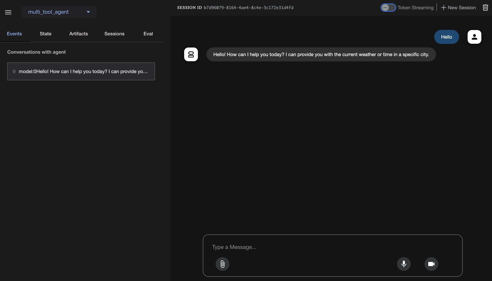

## Setup

```bash
curl -sSL https://sdk.cloud.google.com | bash && exec -l $SHELL && gcloud init
```

setup gcloud.

```bash
gcloud auth login
gcloud auth application-default login
```

Setup environment variables.

```bash
export GOOGLE_CLOUD_PROJECT=`gcloud config list --format 'value(core.project)'`
export GOOGLE_CLOUD_LOCATION=us-central1
```

Setup `.env` file.

```bash
echo "GOOGLE_GENAI_USE_VERTEXAI=TRUE" > ./multi_tool_agent/.env
echo "GOOGLE_CLOUD_LOCATION=us-central1" >> ./multi_tool_agent/.env
echo "GOOGLE_CLOUD_PROJECT=$GOOGLE_CLOUD_PROJECT" >> ./multi_tool_agent/.env
```

## Run

Run the agent.

```bash
adk web
```

## Result

`

## (Option) Setup Python package

```bash
pip install google-adk
```